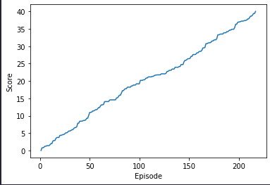

# Project 2 Report
By Matt Eland

I chose the single agent approach (version 1) and hit an average of a score of 30 by episode 217.

_Note: the starter project does not seem to work on Windows so I reimaged a pair of support machines to run Linux Mint 21.1 explicitly for this assignment. If Udacity maintained their dependencies for their OS choices, I could have done this project this morning instead of spending the entire day on it._

## Learning Algorithm

This uses agent / critic learning with a replay buffer to present past scenarios to the agent for evaluation and scoring. It uses an OUNoise generator to help converge on optimal scenarios sooner.

The actors have 2 hidden layers with 256 nodes in each layer. These use feed forward with relu and tanh activation for the two layers.

The critics have 3 hidden layers with 256, 256, and 128 nodes in each layer. These layers use leaky relu activation to feed forward.

The agent itself used the following hyperparameters:

BUFFER_SIZE = int(1e6)  # replay buffer size
BATCH_SIZE = 128        # minibatch size
GAMMA = 0.99            # discount factor
TAU = 1e-3              # for soft update of target parameters
LR_ACTOR = 1e-4         # learning rate of the actor 
LR_CRITIC = 3e-4        # learning rate of the critic
WEIGHT_DECAY = 0.0001   # L2 weight decay

## Performance

The training process illustrated roughly linear performance gains over time, though I had it abort early once the scoring threshold was reached.

I am curious to see what the maximum score this agent could achieve would be and how many episodes it would take to reach that, however I did not simulate this.

## Ideas for Future Work

The big thing I'd want to do with this is to try to adapt this to support training multiple agents at once and have them adequately share knowledge with each other and evaluate the performance of the group as a whole.

I believe this code should already support that, but I suspect modifications would be needed. My big point of curiosity is how it would impact the overall learning time.

I did not play much with the configuration or activation of the neural networks involved and would remedy that a bit more.