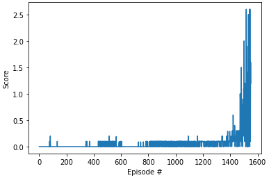

# Project 3 Report
By Matt Eland

_Note: Given prior experiences with this course's maintenance and issues encountered on various Windows devices mixed with the inability to get replies on Udacity's forums, I developed and tested this on Linux Mint 21.1_

## Learning Algorithm

This uses multi-agent DDPG with agent / critic learning and a replay buffer to present past scenarios to the agent for evaluation and scoring. 

It uses an OUNoise generator to help converge on optimal scenarios sooner.

The actors and critics have 2 hidden layers with 256 nodes in each layer. These use batch normalization and relu activation for both layers. Backpropagation is used to help train the networks.

The agent itself used the following hyperparameters:

```py
BUFFER_SIZE = int(1e6)  # replay buffer size
BATCH_SIZE = 128        # minibatch size
GAMMA = 0.99            # discount factor
TAU = 1e-3              # for soft update of target parameters
LR_ACTOR = 1e-4         # learning rate of the actor 
LR_CRITIC = 1e-4        # learning rate of the critic
WEIGHT_DECAY = 0        # L2 weight decay
FC1_unit = 256          # Number of neurons in the first hidden layer
FC2_unit = 256          # Number of neurons in the second hidden layer
```

## Performance

Training was rough and seemed to come very gradually, then in sudden spikes near the end as it converged on its episode target of a score of 0.5 over 100 episodes. Ultimately, it reached this target on episode X.



I am curious to see what the maximum score this agent could achieve would be and how many episodes it would take to reach that, however I did not simulate this.

## Ideas for Future Work

I cannot help but feel that this experiment's rewards function could have been better to give earlier incremental progress indicators. For example, hitting the ball should result in some reward, even if the ball doesn't go over to the other side. Proximity to the ball could also be a factor. Although the scenario is complex, I feel that earlier rewards would probably have been a good move.

I'd like to try a grid-based search of optimal hyperparameters as well, for similar reasons, and experiment with different neural network architectures.